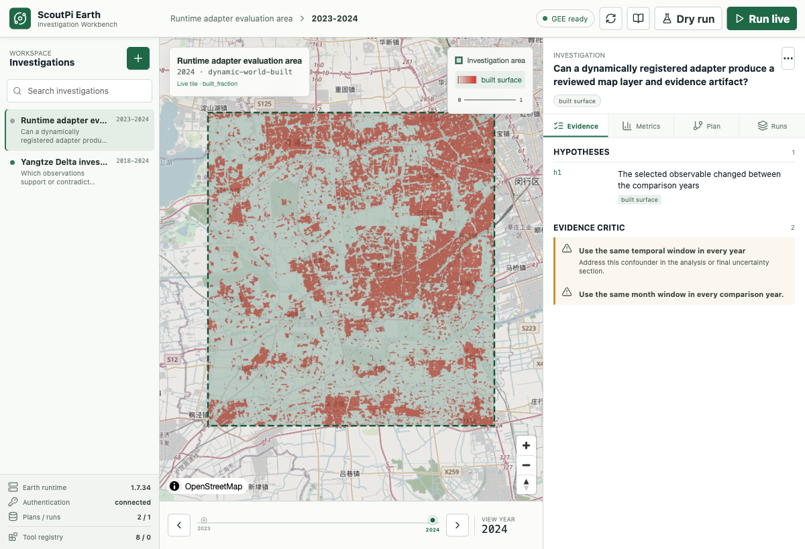

# ScoutPi Workbench

**A Pi-native runtime for building and running evidence-backed Earth investigations.**

[](https://github.com/7155/scoutpi-workbench/actions/workflows/ci.yml)
[](LICENSE)
[](#quick-start)
[](#pi-integration)

ScoutPi Workbench gives Pi a small, typed Earth runtime instead of a permanent collection of scenario tools. At task time, Pi can research a dataset, create a declarative adapter, verify it against Earth Engine, compile an investigation, supervise compute and exports, and preserve a successful workflow as a skill.

Forest, flood, agriculture, urban change, water, climate, and disaster tasks are possible inputs. They are not hard-coded product branches.



## Why This Runtime

```text
question + claims + region + time
  -> Pi lifecycle trace + dynamic Earth tool profile
  -> token-bounded Context Pack with source provenance
  -> observable roles
  -> registered adapter search
  -> Agent drafts a missing adapter when needed
  -> schema validation + revision + fingerprint + live probe
  -> deterministic InvestigationSpec and AnalysisDAG
  -> supervised Earth Engine job or direct map tiles
  -> bounded local export and numerical checks
  -> evidence critic + EarthStory
  -> successful trace compiled into a guarded workflow
  -> optional signed trigger delegation for bounded dry-run replay
  -> token/cost telemetry + replay evidence
```

The model does not execute generated Python, JavaScript, shell, or arbitrary Earth Engine expressions. Pi creates declarative contracts; reviewed runtime code executes them.

## Implemented

- Three registered Pi gateway tools, dynamically activated as core, analysis, and report profiles
- Official Pi 0.80 execution contract with TypeBox schemas, `AbortSignal`, streaming progress, lifecycle events, and structured failures
- Event-only governance extension with parameter-bound, single-use user approval receipts
- Event-only observability extension with privacy-preserving Agent run traces and provider-reported token/cost usage
- Event-only durable checkpoint extension with atomic revisions, integrity checks, compaction hints, and one-time recovery context
- Event-only Context Bridge with provider-neutral candidates, mixed-text token budgets, provenance, user-reviewed writeback staging, and an opt-in idempotent Wisdom Weasel RAG Core adapter
- Event-only Browser Evidence Bridge with allowed-root import, artifact hashes, explicit claim/hypothesis relations, and Agent-trace attachment
- Deterministic Evidence Reviewer that blocks dry-run claims, unsupported findings, broken plan/job/source provenance, and adapter-declared proxy overclaims before EarthStory persistence
- Event-only durable trigger extension with identity-bound HMAC grants, manual/interval/event conditions, idempotent replay, cooldown/expiry/run limits, and no additional model tool
- Local stdio MCP compatibility server with four compact gateways, resource links, and no live/admin operations
- Reviewed Backend Plugin SDK with manifests, validation hooks, bounded progress, cancellation, timeouts, and result limits
- Progressive-disclosure Earth investigation skill
- Dynamic `scoutpi.earth.adapter.v1` registry with revisions, SHA-256 fingerprints, enable/disable state, and audit events
- Live adapter probes that check collection availability, sample time, required bands, and quality-mask bands
- Typed `InvestigationSpec -> DatasetPlan -> AnalysisDAG` compiler with cost and evidence checks
- Dry run, inline Earth Engine metrics, Drive export, task polling, cancellation, and retryable local export jobs
- Direct Earth Engine raster tiles in MapLibre, without first downloading a GeoTIFF
- Bounded geedim GeoTIFF export with scale/pixel review, manifest, byte count, and SHA-256
- Safe CSV/JSON/GeoJSON statistics without arbitrary code execution
- Generated `scoutpi.earth.skill.v1` drafts with confirmed publishing and overwrite protection
- Automatic workflow candidates from verified successful jobs, explicit promotion, deterministic replay, cost assertions, and adapter-drift rejection
- Vue Workbench for maps, plans, jobs, artifacts, recipes, workflows, and a responsive Runtime Center that consolidates capabilities, Context Packs, continuity, approvals, Agent traces, and token/cost telemetry
- Pi Capability Broker over tools and commands, with a durable path-safe capability profile and operator-facing Extensions view, so market-provided research, MCP, memory, browser, context, goals, security, interoperability, evaluation, and subagent capabilities are reused rather than copied

The core does not silently ship an active domain catalog. `examples/adapter-packs/earth-engine-starter.json` is an explicit demo pack and remains separate from runtime code.

## Quick Start

Requirements: Node.js 22.6+, pnpm, uv, and Python 3.11-3.13. The checkout pins Python 3.13 for reproducible local development.

```bash
git clone https://github.com/7155/scoutpi-workbench.git
cd scoutpi-workbench
pnpm install
uv sync --extra pipeline
pnpm examples:seed
pnpm check
pnpm workbench:dev
```

Open `http://127.0.0.1:5173`. The loopback API runs at `http://127.0.0.1:17420`.

`pnpm examples:seed` imports the demo adapter pack into ignored local workspace state. Omit it when Pi should construct every adapter from primary documentation.

The dry-run path does not need Earth Engine credentials. Live compute, probes, tiles, and exports require authentication:

```bash
uv run earthengine authenticate
```

Set `EARTHENGINE_PROJECT` when the account or deployment requires an explicit Google Cloud project.

External MCP hosts can start the separate local stdio surface with `pnpm mcp:stdio`. It does not alter Pi's three-tool surface and intentionally omits live execution, exports, registry mutation, publication, and approval issuance.

### Optional Python Profiles

```bash
uv sync --extra gee        # official Earth Engine API only
uv sync --extra pipeline   # Earth Engine + geedim + geetools
uv sync --extra workbench  # Earth Engine + geemap + leafmap
uv sync --extra climate    # Earth Engine + wxee
uv sync --extra full       # all reviewed foundational backends
```

The Workbench reports installed backends. Optional libraries do not add Pi tool schemas.

## Pi Integration

Install from GitHub:

```bash
pi install git:github.com/7155/scoutpi-workbench
```

Or install the current checkout:

```bash
pi install /absolute/path/to/scoutpi-workbench
```

The repository is also structured as a publishable `pi-package` for Pi's npm-backed gallery, but no npm publication is claimed by this README. `pnpm package:verify` builds a temporary tarball, rejects development/private files and local credentials, extracts it, and starts all seven extensions plus the investigation skill through a real offline Pi RPC process. The npm tarball is the Pi runtime distribution; clone the repository to develop or run the Vue Workbench.

The package exposes seven extensions and one skill. Context, browser evidence, durable triggers, governance, observability, and checkpoints are event-only; the model still sees at most these three Earth tools:

| Tool | Responsibility |
| --- | --- |
| `earth_workspace` | Adapter/backend registry, catalog routing, planning, probes, execution, export, artifacts, telemetry, recipes, and workflows |
| `python_analysis` | Bounded statistics over approved local artifact roots |
| `earth_story` | Evidence-bound story creation and persisted review artifacts |

Important `earth_workspace` operations:

```text
adapter_register / adapter_import / adapter_list
adapter_probe / adapter_enable / adapter_disable
contract / catalog_search / plan / preview / visualize
run / status / cancel / retry
export / export_local / artifacts
skill_save / skill_list / skill_publish
save_recipe / load_recipe / list_recipes
backend_list / backend_probe / telemetry
workflow_compile / workflow_list / workflow_replay / workflow_status
```

Pi starts with only `earth_workspace` active, then activates `python_analysis` and `earth_story` when the task reaches analysis or reporting. High-risk operations are intercepted by `scoutpi-governance` and require a real `ctx.ui.confirm()` receipt; model-authored `confirmed: true` is not trusted.

Use `/earth-ecosystem` in Pi to refresh and inspect reusable peer capabilities after package configuration changes. The same sanitized scan is persisted for the Workbench Runtime Center. ScoutPi does not fetch, install, update, enable, or remove packages; those decisions remain in Pi's official package manager:

```bash
pi list
pi config
pi install npm:<reviewed-package>
pi update --extensions
pi remove npm:<package>
```

Review packages in the [official Pi extension catalog](https://pi.dev/packages?type=extension). Cross-session memory comes from an installed Pi provider; this package does not register a second memory tool surface.

To use the existing Wisdom Weasel input-method Core as the Context provider:

```bash
export SCOUTPI_IME_CORE_ROOT=/absolute/path/to/wisdom-weasel-rag-ime
export SCOUTPI_IME_CORE_DB="$HOME/Library/Application Support/RagIme/rag-ime.sqlite"
```

The adapter queries the existing Core through a fixed, versioned subprocess contract and reuses one bounded worker during the Pi session. Timeout/cancellation kills the worker, idle/session shutdown closes it, and `SCOUTPI_IME_CONTEXT_PERSISTENT=0` restores one-shot execution. It does not enable raw debug output. Writeback remains disabled unless the operator also sets:

```bash
export SCOUTPI_IME_CONTEXT_WRITEBACK=1
```

That path still requires direct Pi UI approval. It stages an integrity-bound delivery and writes only through the Core's own privacy-aware `InputMethodAdapter`, with deterministic event tags for retry deduplication; ScoutPi never issues SQL against the IME database.

Use `/earth-triggers` to inspect durable workflow automation and `/earth-trigger-approve <trigger-id>` to issue an identity-bound dry-run delegation after direct review. Trigger automation never expands the three-tool model surface.

For an existing Edge session, authenticated web research, and browser-managed downloads, install BrowserBridge separately:

```bash
pi install git:github.com/7155/scoutpi-browserbridge
```

## Runtime State

Complete plans and results are written below `.scoutpi/earth_workspace`; Pi receives compact IDs, states, and artifact paths.

```text
.scoutpi/earth_workspace/
├── adapters/             # versioned runtime adapters
├── approvals/            # short-lived, single-use user approval receipts
├── skills/               # validated skill drafts
├── plans/                # immutable typed plans
├── jobs/                 # job state, requests, manifests, GeoTIFF/JSON artifacts
├── recipes/              # reusable InvestigationSpec inputs
├── workflows/            # compiled deterministic workflow contracts
├── workflow_runs/        # replay assertions and terminal state
├── telemetry/            # content-minimal operation metrics
├── stories/              # EarthStory JSON and Markdown
└── registry_events.jsonl # adapter audit trail

.scoutpi/runs/            # privacy-preserving Pi Agent traces and exact model usage
.scoutpi/checkpoints/     # content-minimal session recovery state and journals
.scoutpi/context/         # budgeted Context Packs and reviewed provider writebacks
.scoutpi/evidence/        # normalized browser evidence, copied artifacts and graphs
.scoutpi/triggers/        # signed delegations, durable triggers, event receipts and replay ledger
.scoutpi/pi-ecosystem/    # sanitized Pi tool/command capability profile for operators
```

Temporary Earth Engine tile URLs are for visualization. Download/export is used only when a durable local artifact, offline computation, evidence package, or downstream delivery is required.

## Local API

| Endpoint | Purpose |
| --- | --- |
| `GET /api/environment` | Earth Engine auth and optional backend capabilities |
| `GET /api/mcp` | Local MCP compatibility profile, tools, resources, and blocked operations |
| `GET /api/pi-ecosystem` | Last sanitized Pi tool/command capability scan and official package guidance |
| `GET /api/backends` | Reviewed backend manifests and operation contracts |
| `POST /api/backends/:id/probe` | Probe one reviewed backend |
| `GET /api/telemetry` | Aggregate operation token, latency, cache and compute proxies |
| `GET /api/agent-runs` | Pi lifecycle run summaries and provider-reported model usage |
| `GET /api/checkpoints` | Durable Agent session and interrupted-operation summaries |
| `GET /api/context/packs` | Token-bounded context, provenance and provider summaries |
| `GET /api/context/writebacks` | Pending, approved and rejected memory-provider outbox records |
| `GET /api/evidence` | Investigation-scoped canonical browser evidence records |
| `POST /api/evidence/import` | Import and artifactize an allowlisted BrowserBridge evidence file |
| `POST /api/evidence/:id/bind` | Bind a source to an investigation, claim, hypothesis, and explicit relation |
| `GET /api/evidence/graph/:id` | Browser claims, hypotheses, completed live runs, and finding coverage |
| `GET /api/evidence/review/:id` | Persisted claim, computation, provenance, counterevidence, and proxy review |
| `GET/POST /api/triggers` | List durable triggers or create a reviewable draft |
| `POST /api/triggers/:id/approve` | Issue a loopback-operator dry-run delegation |
| `POST /api/triggers/:id/state` | Pause, resume, or revoke a trigger |
| `POST /api/triggers/:id/invoke` | Idempotently invoke an active manual trigger |
| `GET /api/trigger-runs` | Read the durable trigger replay ledger |
| `GET /api/delegations` | Read signature-free delegation summaries |
| `POST /api/trigger-events` | Dispatch a bounded named event and persist only its hash/count receipt |
| `GET /api/approvals` | Human approval audit receipts |
| `GET /api/contracts/:id` | Fetch an adapter, skill, investigation, or export template on demand |
| `GET/POST /api/adapters` | List or register declarative adapters |
| `POST /api/adapters/:id/probe` | Verify collection and required bands against Earth Engine |
| `POST /api/adapters/:id/state` | Enable or disable an adapter |
| `GET /api/catalog` | Search enabled workspace adapters |
| `POST /api/plans` | Validate a spec and compile a plan |
| `GET /api/plans/:id/visualization` | Create a short-lived Earth Engine tile layer |
| `POST /api/plans/:id/run` | Start a dry run or Earth Engine execution |
| `POST /api/plans/:id/export-local` | Queue a supervised geedim GeoTIFF export |
| `GET /api/jobs/:id?refresh=true` | Refresh provider task state |
| `POST /api/jobs/:id/cancel` | Cancel a remote task or active local worker |
| `POST /api/jobs/:id/retry` | Retry a persisted local export as a new job |
| `GET /api/jobs/:id/artifacts/:name` | Read one bounded job artifact |
| `GET/POST /api/skills` | List or save generated skill definitions |
| `POST /api/skills/:id/publish` | Confirm and publish a generated Pi skill |
| `GET /api/workflows`, `POST /api/workflows/compile` | List workflows or compile one from a successful job |
| `POST /api/workflows/:id/replay` | Deterministically replay with drift and cost assertions |
| `GET /api/workflow-runs/:id` | Refresh a replay record |

## Verification

```bash
pnpm typecheck
pnpm test
pnpm python:check
pnpm harness:earth
pnpm harness:mcp
pnpm package:verify
pnpm web:build
```

The local Context Provider benchmark never invokes a model or writes candidate text into its report:

```bash
SCOUTPI_IME_CORE_ROOT=/absolute/path/to/wisdom-weasel-rag-ime \
SCOUTPI_IME_CORE_DB=/absolute/path/to/rag-ime.sqlite \
pnpm harness:context-provider
```

The real Pi RPC harness is opt-in because it can call a paid model:

```bash
SCOUTPI_HARNESS_KEY_FILE=/path/outside/the/repo/key.md \
SCOUTPI_PI_MODEL=gpt-5.6 \
pnpm harness:pi
```

`harness:pi` performs a model-list preflight only. Start the real extension process without a model turn using `pnpm harness:pi-rpc`; run paid end-to-end cases explicitly with `pnpm harness:pi-live`.

The current live smoke path also verifies a real Dynamic World tile and a small geedim GeoTIFF with Rasterio metadata inspection. Live checks depend on the operator's Earth Engine account and are not part of CI.

## Documentation

- [Runtime architecture](docs/scoutpi/SCOUTPI_PI_EARTH_INVESTIGATION_RUNTIME.md)
- [Agent-built adapters and skills](docs/scoutpi/AGENT_TOOL_SKILL_BUILDER.md)
- [Backend Plugin SDK](docs/scoutpi/BACKEND_PLUGIN_SDK.md)
- [Runtime governance and observability](docs/scoutpi/RUNTIME_GOVERNANCE_AND_OBSERVABILITY.md)
- [Durable Agent checkpoints](docs/scoutpi/DURABLE_AGENT_CHECKPOINTS.md)
- [Context Bridge](docs/scoutpi/CONTEXT_BRIDGE.md)
- [Browser Evidence Bridge](docs/scoutpi/BROWSER_EVIDENCE_BRIDGE.md)
- [Evidence Reviewer](docs/scoutpi/EVIDENCE_REVIEWER.md)
- [MCP compatibility server](docs/scoutpi/MCP_COMPATIBILITY.md)
- [Durable triggers and delegation](docs/scoutpi/DURABLE_TRIGGERS_AND_DELEGATION.md)
- [Workflow Compiler](docs/scoutpi/WORKFLOW_COMPILER.md)
- [Pi RPC Harness](docs/scoutpi/PI_RPC_HARNESS.md)
- [Pi ecosystem reuse audit](docs/scoutpi/PI_OPEN_SOURCE_ECOSYSTEM_REUSE_AUDIT.md)
- [Pi package and gallery release](docs/scoutpi/PI_PACKAGE_RELEASE.md)
- [Project notes](docs/agent/notes.md)

## Project Status

The typed runtime, dynamic registry, Workbench, direct tiles, local export, and deterministic dry-run paths are implemented. Live results still depend on account authorization, quota, dataset availability, and requested region/scale. ScoutPi never labels a plan, mock, or missing artifact as a computed finding.

## Implementation References

The product direction and the `Pi -> typed investigation -> supervised compute -> evidence Workbench` architecture are original to this project. The implementation is independent and does not copy source from the projects below. They informed specific APIs and engineering tradeoffs:

| Project | What was studied | ScoutPi boundary |
| --- | --- | --- |
| [earendil-works/pi](https://github.com/earendil-works/pi) and upstream [badlogic/pi-mono](https://github.com/badlogic/pi-mono) | Typed extension lifecycle, RPC mode, commands, skills, user UI and active-tool APIs | Pi remains the host Agent loop; ScoutPi contributes domain tools plus event-only governance and tracing. |
| [modelcontextprotocol/typescript-sdk](https://github.com/modelcontextprotocol/typescript-sdk) | Stable 1.x stdio server, resources, resource links, annotations, and in-memory protocol testing | ScoutPi exposes four high-level compatibility gateways; it does not replace Pi or implement another generic MCP client. |
| [google/earthengine-api](https://github.com/google/earthengine-api) | Initialization, map IDs, batch exports, task status, and cancellation | The worker exposes typed operations and never evaluates generated Earth Engine code. |
| [gee-community/geemap](https://github.com/gee-community/geemap) | Analyst-facing Earth Engine maps, charts, and export conventions | Optional review backend; BrowserBridge does not click through geemap widgets. |
| [leftfield-geospatial/geedim](https://github.com/leftfield-geospatial/geedim) | Tiled local GeoTIFF, NumPy, and Xarray delivery | Used behind a bounded, supervised `export_local` contract. |
| [gee-community/geetools](https://github.com/gee-community/geetools) | Reusable Earth Engine preprocessing and object extensions | Pipeline dependency; future operations remain reviewed and typed. |
| [davemlz/eemont](https://github.com/davemlz/eemont) | Concise preprocessing and spectral-index API design | Interface reference only to avoid two competing execution dialects. |
| [opengeos/leafmap](https://github.com/opengeos/leafmap) | Local raster/vector, STAC, PostGIS, and map integration | Optional local-data Workbench backend. |
| [google/Xee](https://github.com/google/Xee) and [aazuspan/wxee](https://github.com/aazuspan/wxee) | Earth Engine/Xarray bridges for long time series | Optional climate capability, not default tool surface. |
| [opengeos/GeoAgent](https://github.com/opengeos/GeoAgent) | Geospatial adapter metadata and confirmation boundaries | ScoutPi uses a small Pi gateway surface and deterministic compiler. |
| [opendatalab/Earth-Agent](https://github.com/opendatalab/Earth-Agent) | EO task taxonomy and trajectory evaluation ideas | ScoutPi emphasizes reproducible plans, probes, artifacts, and task supervision. |
| [microsoft/Earth-Copilot](https://github.com/microsoft/Earth-Copilot) | Separation of discovery, analysis, and visualization | ScoutPi is local-first, Pi-native, and dynamically adapter-driven. |
| [opengeos/segment-geospatial](https://github.com/opengeos/segment-geospatial) and [HYDRAFloods](https://github.com/Servir-Mekong/hydra-floods) | Examples of mature algorithm providers | Future optional backends, never hard-coded scenario branches. |
| [7155/scoutpi-browserbridge](https://github.com/7155/scoutpi-browserbridge) | Existing-browser research, downloads, and evidence capture | Browser control stays a separate install so Earth tools remain compact. |
| [Pi package catalog](https://pi.dev/packages?type=extension), [pi-extmgr](https://github.com/ayagmar/pi-extmgr), and [pi-goal](https://github.com/Michaelliv/pi-goal) | Native package discovery/management and persistent autonomous-goal state | ScoutPi detects and routes compatible peers; it never auto-installs packages or replaces the generic goal loop. |
| [pi-intercom](https://github.com/nicobailon/pi-intercom), [pi-mcp-adapter](https://github.com/nicobailon/pi-mcp-adapter), and [pi-subagents](https://github.com/nicobailon/pi-subagents) | Bounded session messaging, lazy schemas/output guards, atomic artifacts, budgets, and watchdog recovery | Reused as peer capabilities; ScoutPi owns only typed domain exchange contracts and deterministic execution. |
| [sysid/pi-extensions](https://github.com/sysid/pi-extensions) | Event interception, symlink-aware path guards, default-deny writes, and optional OS sandboxing | Generic isolation composes with, but does not replace, ScoutPi's parameter-bound domain governance. |
| [7155/wisdom-weasel-rag-ime](https://github.com/7155/wisdom-weasel-rag-ime) | Local cross-application RAG/memory, provenance lanes, anti-echo and memory governance | Used through a query-only provider contract; Context Bridge owns task ranking, token budget and runtime trace attachment. |

See [PI_OPEN_SOURCE_ECOSYSTEM_REUSE_AUDIT.md](docs/scoutpi/PI_OPEN_SOURCE_ECOSYSTEM_REUSE_AUDIT.md) for the wider reuse decision.

## Contributing And Security

See [CONTRIBUTING.md](CONTRIBUTING.md) for the contract-first workflow and [SECURITY.md](SECURITY.md) for the local runtime threat model. Contributions are accepted under the [Apache-2.0 license](LICENSE).
